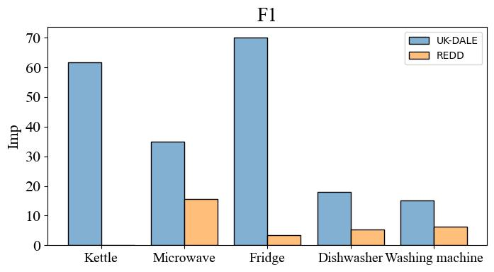

# Transfer Learning for Multiappliance-Task Nonintrusive Load Monitoring

This code implements the sequence-to-sequence(seq2seq) learning model. Then, this code not only implements transfer learning for NILM on single appliances but also extends to transfer learning for multiple appliances.

## Data

The csv datasets could be downloaded here: [REDD](http://redd.csail.mit.edu/) , [UK-DALE](https://jack-kelly.com/data/) and [REFIT](https://pureportal.strath.ac.uk/en/datasets/refit-electrical-load-measurements) .Preprocess the source data. The preprocessing code is in the dataset_management folder. You can also download the processed data directly.The preprocessed [dataset](https://drive.google.com/drive/folders/1WXsUGe8bh2-L2_ZBiB7hL_4_VBfwvXhq?usp=sharing) is also made public.

## Train model

To reproduce the multiple appliance model on the dataset, run the following command:

```
python train.py
```

If you want to change some hyperparameters, you can check it in the argument.py file.Or you can provide the information in this example.

```
python train.py --training_dataset_path 'dataset_management/refit/total/train_set2.npy' --val_dataset_path 'dataset_management/refit/total/val_set2.npy' --batch_size 100
```

To reproduce the single appliance model on the dataset, run the following command:

```
python train_one_appliance.py  --channel 0
```

Changing the channel allows you to choose which appliance to train

## Transfer Learning

The following code can be used for transfer training on the source model. 'model_path' is the path to the source model you want to use for transfer training.

```
python transfer_multi_appliance.py --model_path 'model/transfer_multi_appliance_uk/best_acc_model.pth'
```

## Test model

Use the following command to test the performance of your model. When testing different data sets, remember to adjust the mean and standard deviation.

```
python .\test\test_model.py --test_dataset_path 'dataset_management/ukdale/total/test_set.npy' --model_path 'model/transfer_multi_appliance_uk/best_acc_model.pth'
```

If you want to test the performance of single appliance model. 

```
python .\test\test_model_one_appliance.py --test_dataset_path 'dataset_management/redd/total/test_set.npy' --model_path 'model/transfer_single_appliance_redd/m-i-c-r-o-w-a-v-e/best_acc_model.pth' --channel 1
```

## Performance


Improvement of multi-appliance model compared with single appliance model.





## Citation

If you find this repo useful for your research, please consider citing our paper:
```
@ARTICLE{10885528,
  author={Sun, Yao and Feng, Jianwei and Yuan, Liang and Su, Mei and Luan, Wenpeng},
  journal={IEEE Transactions on Instrumentation and Measurement}, 
  title={Transfer Learning for Multiappliance-Task Nonintrusive Load Monitoring}, 
  year={2025},
  volume={74},
  number={},
  pages={1-12},
  keywords={Transfer learning;Feature extraction;Training;Computational modeling;Load modeling;Data models;Attention mechanisms;Accuracy;Neural networks;Load monitoring;Attention mechanism;energy disaggregation;multitask learning;nonintrusive load monitoring (NILM);transfer learning},
  doi={10.1109/TIM.2025.3541652}}
```
